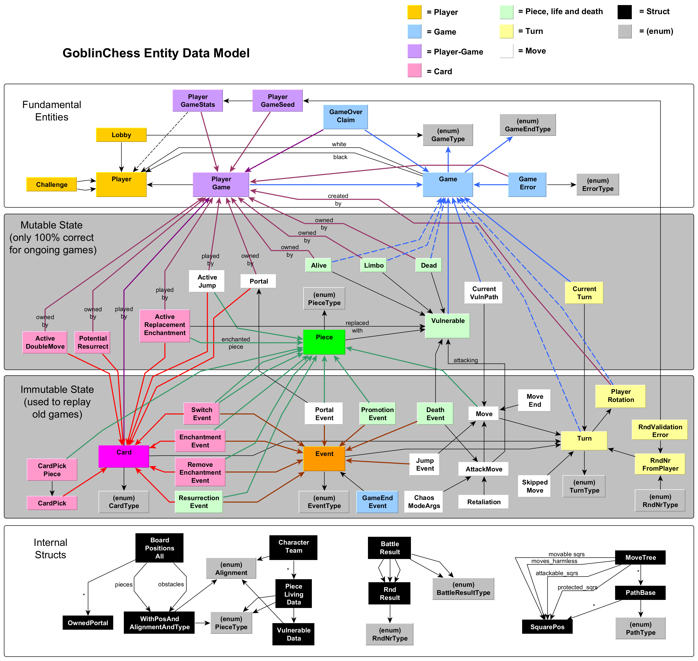
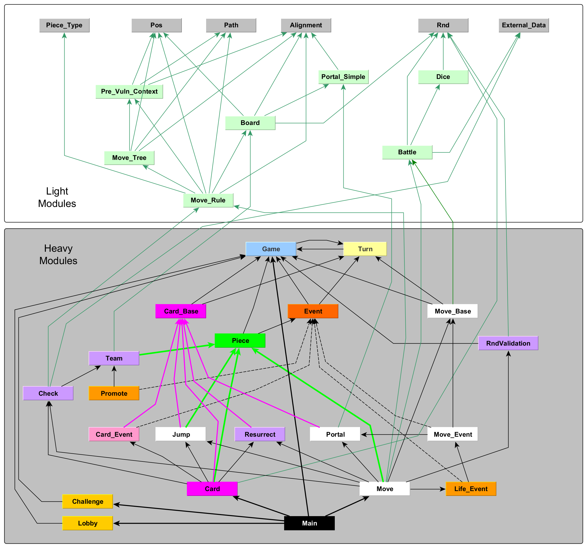
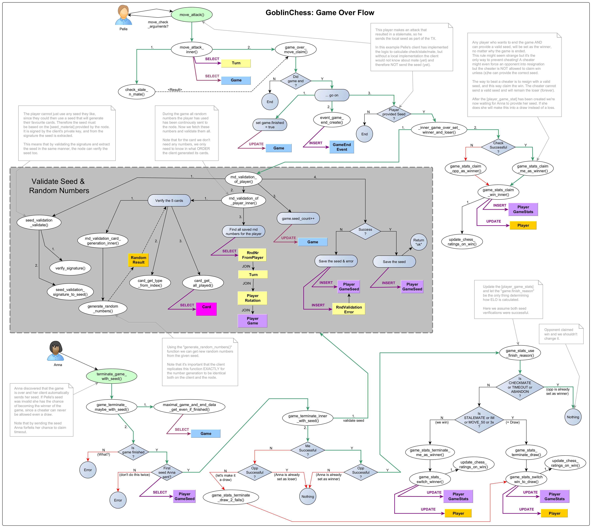
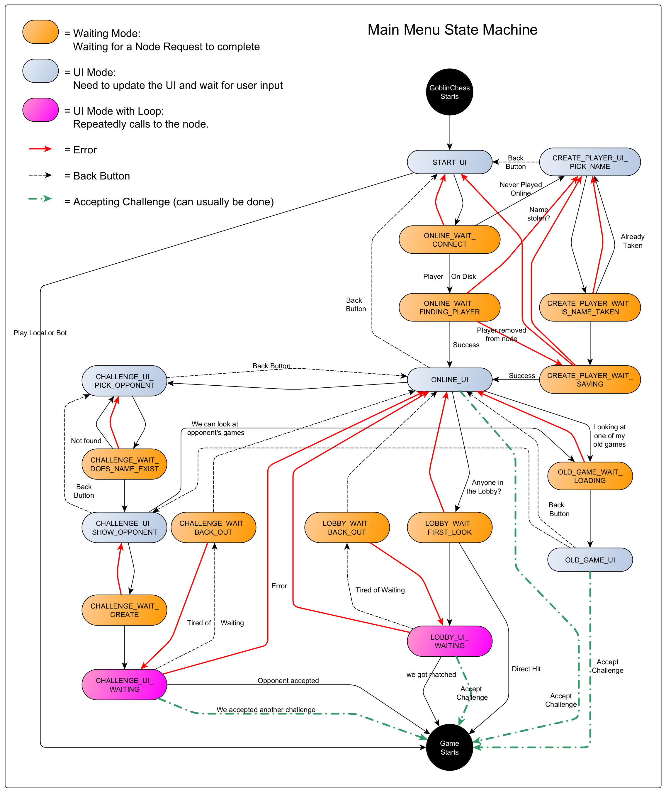
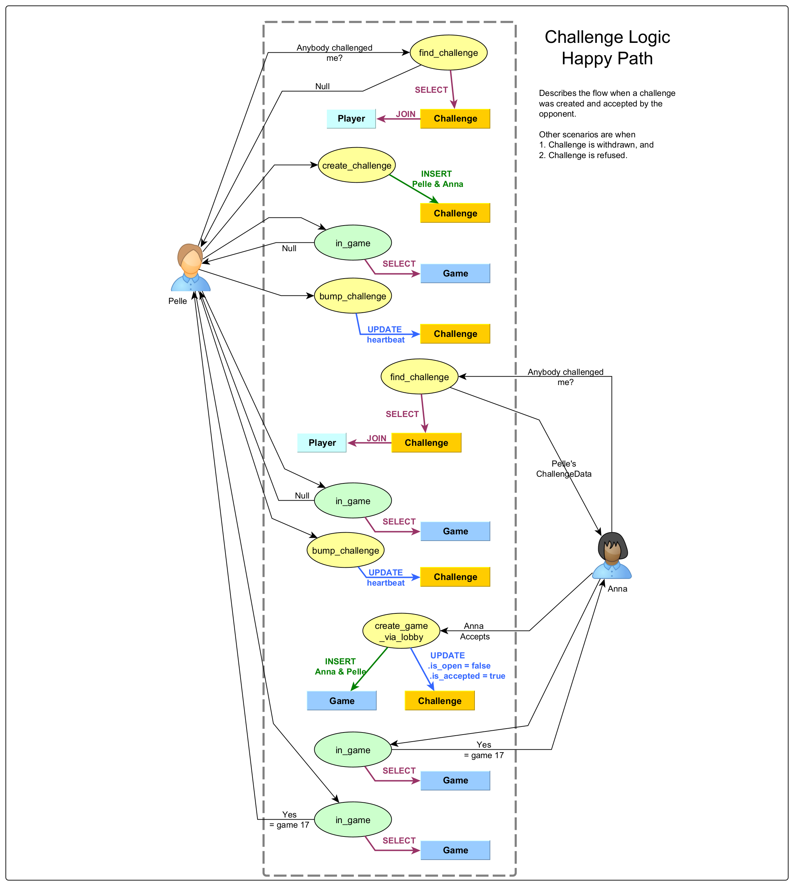
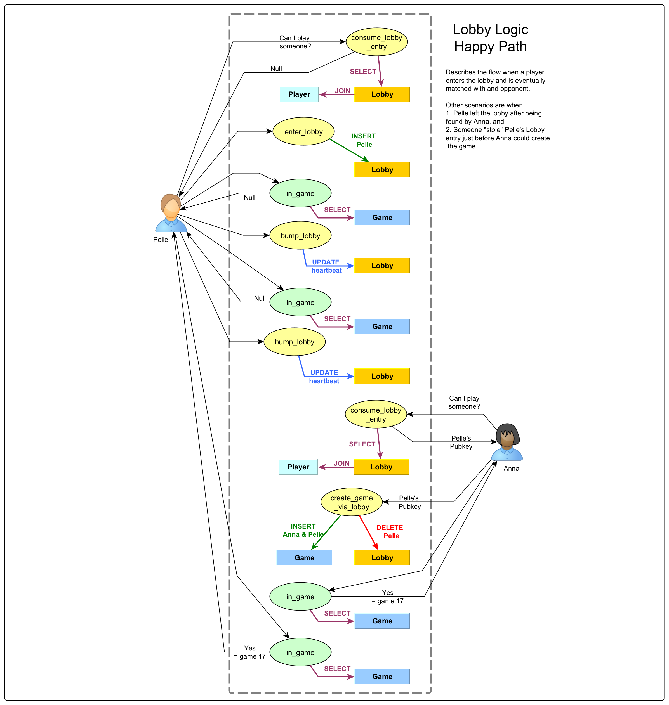

A decentralized chess variant built on the Chromia blockchain using the Rell programming language. GoblinChess combines traditional chess mechanics with magical cards.

## 📋 Table of Contents

- [🎮 What is GoblinChess?](#-what-is-goblinchess)
  - [Key Features](#key-features)
- [🛠️ Who is this for?](#️-who-is-this-for)
  - [For Client Developers](#for-client-developers)
  - [For Rell Learners](#for-rell-learners)
- [🎯 Gameplay](#-gameplay)
  - [Spell Cards](#spell-cards)
    - [Enchantments](#enchantments)
    - [Board Manipulation](#board-manipulation)
    - [Delayed Spells](#delayed-spells)
  - [Game Modes](#game-modes)
    - [Classic Mode](#classic-mode)
    - [Chaotic Mode](#chaotic-mode)
  - [Playing the Game](#playing-the-game)
- [🔧 API](#-api)
  - [Operations](#operations)
    - [Initial Operations](#initial-operations)
    - [Game Creating Operations](#game-creating-operations)
    - [Running Game Operations](#running-game-operations)
  - [Queries](#queries)
    - [Sample Queries](#sample-queries)
- [🚀 Developer Getting Started](#-developer-getting-started)
  - [Prerequisites](#prerequisites)
  - [Installation](#installation)
- [📚 Technical Documentation](#-technical-documentation)
  - [Entity Relationship diagram](#entity-relationship-diagram)
  - [Modules](#modules)
    - [Core Modules](#core-modules)
  - [Turn Structure](#turn-structure)
  - [Randomness Handling](#randomness-handling)
  - [Main Menu](#main-menu)
  - [Automatic Testing](#automatic-testing)
- [🤝 QnA](#-qna)
  - [Tokens?](#tokens)
  - [Why put games on the blockchain?](#why-put-games-on-the-blockchain)
  - [Why Chromia?](#why-chromia)
  - [How do I report problems?](#how-do-i-report-problems)
- [📄 License](#-license)
- [🔗 Links](#-links)

## 🎮 What is GoblinChess?

GoblinChess is an innovative chess variant that introduces magical elements to the classic game. Players not only move pieces according to traditional chess rules but can also play spell cards to enchant pieces, manipulate the board, and create strategic advantages.

### Key Features
- **Traditional Chess Foundation**: In the beginning of the game only standard chess pieces exist on the board
- **Spell Card System**: 10 spell cards that can alter gameplay, each player starts with five random cards
- **Multiple Game Modes**: Classic and Chaotic variants with different time controls
- **ELO Rating System**: Standard chess ranking system for anyone playing online
- **Modern Chess Rules**: Supports everything you'd expect from competitive chess, e.g. en passant, repetition draw (3x), stalemate etc 
- **Replay System**: Full game reconstruction from event logs
- **Decentralized**: Fully on-chain. Nothing stored off-chain

## 🛠️ Who is this for? 
Why are you reading this?

### For Client Developers
This backend provides a complete API for building GoblinChess clients. Being on a blockchain means that the data belongs to everyone and nobody, it's yours if you want to.

### For Rell Learners
This codebase serves as a tutorial for:
- Complex entity relationships in Rell
- State management in blockchain applications
- Game logic implementation
- Event-driven architecture
- Query optimization and how to reduce load on the database/blockchain.

There are plenty of comments around the code, it is meant to be one big tutorial.

## 🎯 Gameplay 
A quick overview of the rules and features.

### Spell Cards
GoblinChess is chess-with-cards. The more twisted the cards are, the harder it is to implement them without bugs!

#### Enchantments
- **🐸 Frog**: Transform a piece temporarily, altering its movement capabilities
- **🗿 Turn to Stone**: Petrify a piece, making it immobile for 3 turns
- **🧪 Potion**: Enhance a piece with extra hitpoints (only works for Chaos mode)
- **⚔️ Knighted**: Grant knight-like movement to any piece
- **🦘 Jump**: Allow a piece to leap over obstacles

#### Board Manipulation
- **🔄 Switch Place**: Swap positions of two pieces instantly
- **🧱 Wall**: Create barriers on the board to block movement
- **🌀 Portal**: Create a permanent magical gateway for piece teleportation

#### Delayed Spells
- **💀 Resurrect**: Bring back a captured piece (delayed effect)
- **⏳ Double Move**: Make two moves in a single turn

###  Game Modes
The game can be played in one of two modes:

#### Classic Mode
- Traditional chess emphasis on few random events and a lot of strategy. 

#### Chaotic Mode
- More unpredictable gameplay, since the result of every attack is determined by rolling dice. Primarily for kids or if you want to beat someone above your rating. 

### Playing the Game
The gameplay consists of four main phases:
1. **Register as a Player**: Create your player profile with a unique username
2. **Join Lobby or Create Challenge**: Find opponents through the lobby system or direct challenges
3. **Play**: Alternate between playing spell cards and moving pieces
4. **Win Conditions**: Achieve checkmate, stalemate, timeout victory or something else. There are ten ways to end the game, similar to modern chess.

## 🔧 API
A Chromia dApp exposes a host of REST endpoints, divided into "operations" and "queries":

### Operations
To get a feel for the API we here describe the most common operations. A "Chromia operation" is something that updates the blockchain, and will therefore take some time (a fraction of a second) before the next block is built and the new data is visible.

#### Initial Operations
- `create_player(name)` - Register a new player
- `enter_lobby(name, game_type)` - Join matchmaking lobby, looking for someone within your rating range to play the given type of game.
- `create_challenge(opponent, game_type)` - Challenge specific player on a specific type of game

#### Game Creating Operations
- `create_game_via_lobby(opponent, game_type)` - Start game from lobby
- `create_game_accept_challenge(challenge_id)` - Accept a challenge

#### Running Game Operations
- `play_card(game_id, card_data, picks)` - Cast a spell card
- `move_peaceful/move_attack(game_id, move_data)` - Make chess moves
- `skip_neutral_move(game_id)` - Skip neutral phase. This needed to be forward compatible with version 2.0.

### Queries 
A Chromia query won't update the blockchain, and will therefore return data immediately to the caller:

#### Sample Queries
- `get_player_by_name(player_name)` - Get the player's pubkey from the name, if found
- `in_game(player_pubkey)` - Retrieve the current game for the player, if any
- `find_challenge(player_pubkey, timestamp)` - Returns a not-too-old challenge for the player, if any.

## 🚀 Developer Getting Started
You can try out this code by cloning the repo and and start a Chromia node on your local computer.

### Prerequisites
- PostgreSQL

### Installation
You will need to install these Chromia-specific tools:
- Chromia blockchain environment, but only the `CHR` tool is needed.
- An editor with a Rell plugin is nice (Rell version 0.14.2 or higher), unless you like to read code in black-n-white?

For how to setup your environment you can visit: https://docs.chromia.com/ .
You can also watch my videos explaining how I did it for this game: https://www.youtube.com/@GoblinChess_Olle

## 📚 Technical Documentation

### Entity Relationship diagram
Chromia is unique among blockchain platforms since it builds on database tables, called "entities". There are also "structs", and "enums" which work just like in other programming languages. This is the ER-diagram for the game: 

### Modules
The archtecture is based on the entity-relationship concept (from relational databases), but the logic is structured into modules, whereas each module holds a mix of entities, structs, enums and functions. Just like for programming in general, the idea is to encapsulate logic and keep the dependencies between modules to a minimum. In this game the module structure looks like this:

The "light modules" don't have any dependencies to entities. They are fast/easy to test automatically. The "heavy modules" are harder to unit test, since they will need extensive preparation of data before each test.

#### Core Modules
 the logic of the code is  Here are some core conepts:
- **Main**: All operations and queries are defined in here. It's the entry point to the dApp.
- **Game**: Contains the entities `game`, `player` and the connection table `player_game`. Also handles various statistics for finished games.  
- **Challenge/Lobby**: These are the only two ways to create a new game.
- **Turn**: Turn progression with card/move/neutral phases.
- **Piece**: Controlse the life-cycle of the pieces. Contains enities like `alive`, `limbo` and `dead`. 
- **Move**: Traditional chess piece movement validation, with extra rules for enchanted pieces.
- **Card**: Spell casting mechanics and effect resolution.
- **Board**: Keeping the board in memory during an operation is usually the most performant alternative. We use the `board_positions_all` struct to pass this information around.
- **Check**: Chess rule validation expanding on the traditional ones, since the cards (especially portals) effect the checkmate calculation.
- **Event**: Events are immutable, an can be used for replay functionality. This means old games can be analyzed by looking at (only) the event entities.

### Turn Structure
Each player rotation consists of three turns:
1. **Card Turn**: Play a spell card (optional)
2. **Move Turn**: Make a chess move
3. **Neutral Turn**: Reserved for future neutral piece mechanics OR a double move.

There is a state machine validating that the progression from one turn to the next follows our rules called `verify_old_turn_type_new_turn_type()`:

[View turn validation logic →](src/turn/function_validation.rell)

### Randomness Handling
Handling random numbers is hard on the blockchain, since everything we save becomes public info. In this game we simply accept any random number from the client, but in the very end of the game we will verify all the sent random numbers in one go, by generating them just like the client did, using the client's seed. This works since both clients are required to provide their seeds at the end of the game, and if a player just shuts down their client prematurely they will lose due to the missing seed. 

> **⚠️ Security Note**
> 
> Had we stored the seeds early in the game, a player might try to fetch the opponent's seed and this way be able to generate the opponent's cards (which are supposed to be secret). 

This pic illustrates the seed validation process:  

### Main Menu
The Main Menu of the game client uses this flow, shown in the picture below. The red arrows can be ignored, since they only become relevant if there is an unexpected error happening on the node. Note that wherever we are - as long as we have "gone online" - we can always accept an incoming challenge, this way beginning a new game. 

To create a game is easy, but waiting for other players to accept an invitation means we need to do polling. This is because a blockchain is ignorant about the world outside, and cannot initiate contacts from server to client. Especially challenges are tricky, since both the player creating the challenge, and the player about to be challenged are polling for news at the same time. The picture below shows an example of a successful challenge: 

The process is similar for the Lobby: 

### Automatic Testing
The code has one big test that runs a complete game, from the first move to the inevitable checkmate, where we try to insert as many strange situations as possible:

[View turn validation logic →](src/test/test_all.rell)

 We could have created more isolated tests, with unique database setup for each one. The benefit of this method is that we'll get an exact error message for every single test. But we were too lazy to do that in this project, instead we just setup a full game and tried to catch as many situations as possible inside this test-game. This is one way to do it, not necessarily the best one.

## 🤝 QnA

### Tokens?
Yes this is a blockchain, but there are no tokens in this game. The commercial gaming-client can be bought for a few bucks, that is the only income-generating part of the project.

### Why put games on the blockchain?
For on-chain games you (the reader) are free to implemenent a new game client, fork this code and/or fork the blockchain. Should this become a popular game, having the data open from get-go will prevent the original developer (me) from raising prices or whatever evil things I might do in the future. Keeping everything in the open is a solid strategy.

### Why Chromia?
Chromia is a great platform for developing software, no matter if you are using tokens or not. The principle is openness: Open source, open data. The multi-chain approach makes performance problems a breeze. There are no transaction fees, making everything much easier. Disclaimer: Olle is a Core developer working for Chromaway, the company behind Chromia.

### How do I report problems?
If you find a bug/security hole, please create a pull request or email info _at_ goblinchess (dot) com. 

## 📄 License

MIT License

Copyright (c) 2025 Panaq AB, Olle Kullberg

Permission is hereby granted, free of charge, to any person obtaining a copy
of this software and associated documentation files (the "Software"), to deal
in the Software without restriction, including without limitation the rights
to use, copy, modify, merge, publish, distribute, sublicense, and/or sell
copies of the Software, and to permit persons to whom the Software is
furnished to do so, subject to the following conditions:

The above copyright notice and this permission notice shall be included in all
copies or substantial portions of the Software.

THE SOFTWARE IS PROVIDED "AS IS", WITHOUT WARRANTY OF ANY KIND, EXPRESS OR
IMPLIED, INCLUDING BUT NOT LIMITED TO THE WARRANTIES OF MERCHANTABILITY,
FITNESS FOR A PARTICULAR PURPOSE AND NONINFRINGEMENT. IN NO EVENT SHALL THE
AUTHORS OR COPYRIGHT HOLDERS BE LIABLE FOR ANY CLAIM, DAMAGES OR OTHER
LIABILITY, WHETHER IN AN ACTION OF CONTRACT, TORT OR OTHERWISE, ARISING FROM,
OUT OF OR IN CONNECTION WITH THE SOFTWARE OR THE USE OR OTHER DEALINGS IN THE
SOFTWARE.

## 🔗 Links

- **Chromia Documentation**: https://docs.chromia.com/
- **Rell Language Reference**: https://docs.chromia.com/rell/language-features/
- **About the game**: http://goblinchess.com/

---

*Ready to cast your first spell? Join the battle and experience chess like never before!* ⚔️✨